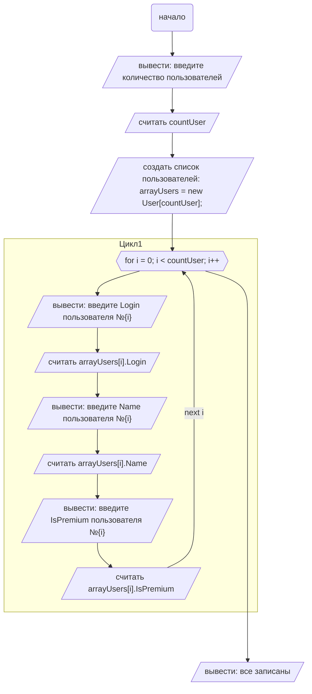

```mermaid
flowchart TD
    Begin(начало) -->
    Task1[/"вывести: введите количество пользователей"/] -->
    Task2[/"считать countUser"/] -->
    Task3[/"создать список пользователей: arrayUsers = new User[countUser];"/]
    Task3 --> Cycle1
    subgraph "Цикл1"
        Cycle1{{"for i = 0; i < countUser; i++"}} -->
        Task4[/"вывести: введите Login пользователя №{i}"/] -->
        Task5[/"считать arrayUsers[i].Login"/] -->
        Task6[/"вывести: введите Name пользователя №{i}"/] -->
        Task7[/"считать arrayUsers[i].Name"/] -->
        Task8[/"вывести: введите IsPremium пользователя №{i}"/] -->
        Task9[/"считать arrayUsers[i].IsPremium"/] -->
        |next i|Cycle1
      end
    Task10[/"вывести: все записаны"/]
    Cycle1 ---------> Task10
    
    
```

by https://mermaid.js.org
and https://habr.com/ru/articles/652867/#flowchart